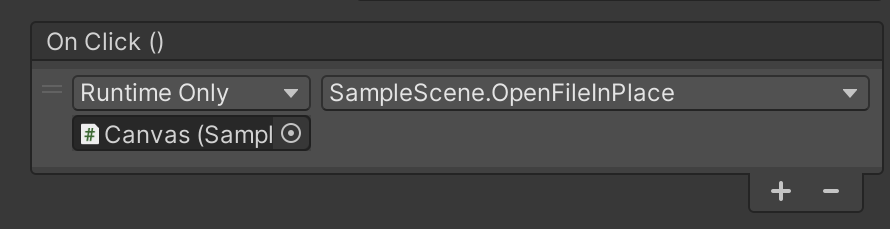
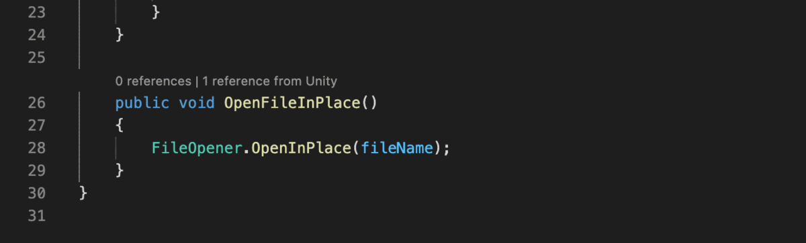

# Unity Event Lens

A code lens for events in the Unity editor. In other words, it uses this in the Unity editor:

To show this in Visual Studio Code:

## Extension Settings

This extension contributes the following setting:

* `unity-event-lens.useAccurateParsing`: This extension parses C# files to find `UnityEvent` members and the public methods they call. By default it uses regular expressions to parse them which is fast but occasionally inaccurate. Change this setting to `true` to parse the C# files with an [ANTLR parser](https://github.com/tunnelvisionlabs/antlr4ts) and [C# grammar](https://github.com/antlr/grammars-v4/tree/master/csharp), which is slower but potentially more accurate.
